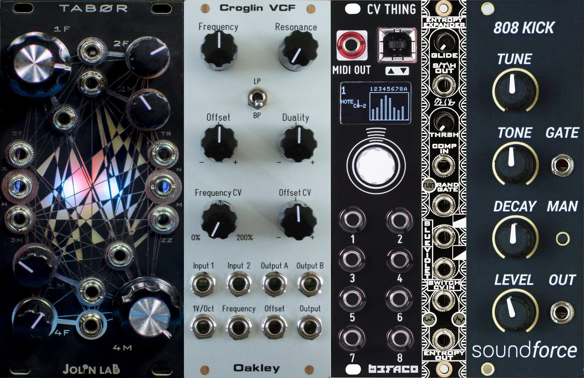

# modulair

These are scripts to fetch images of modules from modular sythesizers and format them for training in an object detection model.

You can read all about this mini-project here:

https://dev.to/hammertoe/using-machine-learning-to-catalog-modular-synthesizers-co2
